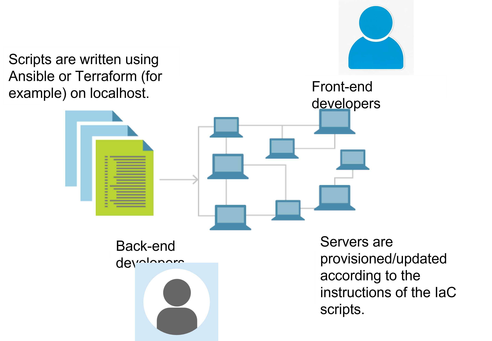
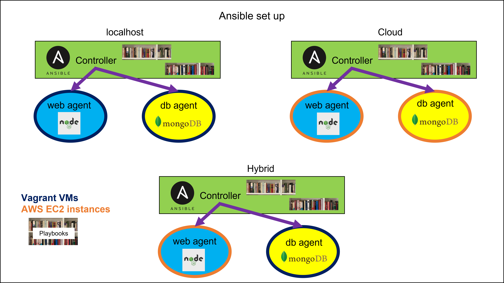
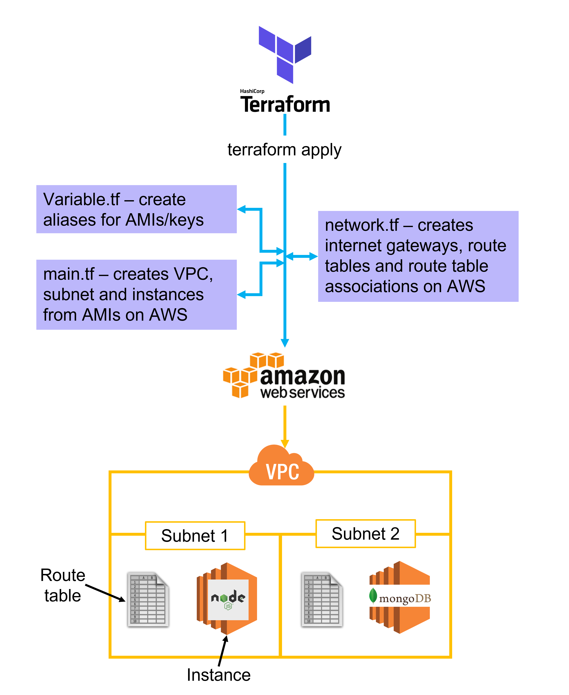

# Infrastructure_as_code

This repository covers: 
- The theory and benefits of Infrastructure as Code. 
- Using Ansible and Terraform with the Sparta Global test app.

# Infrastructure as Code (IaC)

## What is IaC?
- The management of infrastructure (networks, virtual machines, load balancers and connection topology) in a descriptive model, using the same versioning as DevOps team uses for source code.
- Idempotency is key: regardless of the starting state, a deployment command will always configure the target environment into the same configuration.
- If changes are needed, the source is modified rather than the target. 

What are the benefits?

- Avoids the problem of environmental drift - without IaC, teams mantain the settings of individual deployment environments, and each one becomes a snowflake - a unique configuration that cannot be reproduced. This inconsistency between environments requires manual interventions that are difficult to track, causing errors.
- Applications are tested in production environments as soon as workable code is ready.
- Deployment environments can be tested and validated to prevent deployment issues.
- Increased reliability.
- More stable and scalable environments.
- Rapid deployment.
- Reduced costs due to above.

What tools are available?

- Terraform
- AWS CloudFormation
- Azure Resource Manager
- Google Cloud Deployment Manager
- Chef
- Puppet

What is configuration management and orchestration under IaC?
- Configuration management is a process to systematically manage, organise and control changes in all parts of the Software Development Life Cycle.
- Orchestration: Automated configuration, management and coordination of computer systems.
- Usually, automation applies to a single task, and orchestration is how one automates a process involving multiple steps across disparate systems. 

What tools are available for config management and orchestration?
- CM: Ansible (which is open source), Puppet, Chef, SaltStack
- Orchestration: Terraform

What is the difference between Config Management and orchestration?
- Config management installs and manages software on existing servers.
- Orchestration provision servers, and leave configurations to other tools. It focuses on configuration across complex environments.

Why should we use it?
- With orchestration, immutability helps avoid configuration drift.
- CM is better for specific applications within a server.

Use cases/examples
- DevOps teams don't have to manually set up processes such as CICD/CDe pipelines.

Pull and push models of configuration management
- Pull: nodes are dynamically updated with configurations that are present in the server.
- Push: Centralised server pushes configurations to the nodes.

# Ansible

Dependencies: Vagrant and Virtual Box

- [Set Up](./documentation/Ansible_set_up.md)
- [Using AWS with Ansible](./documentation/AWS_Ansible.md)
- [Hybrid architecture](./documentation/hybrid.md)

# Terraform

- [Install terraform](https://www.terraform.io/downloads).
- Make a directory and write the main.tf/network.tf/variables.tf files inside.
- Run `terraform init`.
- `terraform plan` will raise any syntax errors or other problems.
- If there are no errors, `terraform apply` will implement the .tf files.
- Terraform state: When terraform apply is run, Terraform checks whether anything has changed in the .tf files. It then makes only the necessary changes, and leaves everything else.