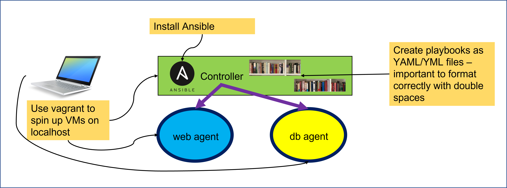

# Set Up Ansible



>1. Create a `vagrantfile` with the below configuration:

```vagrant
# -*- mode: ruby -*-
# vi: set ft=ruby :

# All Vagrant configuration is done below. The "2" in Vagrant.configure
# configures the configuration version (we support older styles for
# backwards compatibility). Please don't change it unless you know what you're doing.

# MULTI SERVER/VMs environment 
#
Vagrant.configure("2") do |config|

    # creating first VM called web  
      config.vm.define "web" do |web|
        
        web.vm.box = "bento/ubuntu-18.04"
       # downloading ubuntu 18.04 image
    
        web.vm.hostname = 'web'
        # assigning host name to the VM
        
        web.vm.network :private_network, ip: "192.168.33.10"
        #   assigning private IP
        
        #config.hostsupdater.aliases = ["development.web"]
        # creating a link called development.web so we can access web page with this link instread of an IP   
            
      end
      
    # creating second VM called db
      config.vm.define "db" do |db|
        
        db.vm.box = "bento/ubuntu-18.04"
        
        db.vm.hostname = 'db'
        
        db.vm.network :private_network, ip: "192.168.33.11"
        
        #config.hostsupdater.aliases = ["development.db"]     
      end
    
     # creating our Ansible controller
      config.vm.define "controller" do |controller|
        
        controller.vm.box = "bento/ubuntu-18.04"
        
        controller.vm.hostname = 'controller'
        
        controller.vm.network :private_network, ip: "192.168.33.12"
        
        #config.hostsupdater.aliases = ["development.controller"] 
        
      end
    
    end
```
> 2. Run `vagrant up`.

> 3. ssh into the controller (using `vagrant ssh controller` etc.) and run update/upgrade commands.

> 4. Run these commands in the `controller` VM:
```bash
sudo apt-get install software-properties-common
sudo apt-add-repository ppa:ansible/ansible
sudo apt-get update -y
sudo apt-get install ansible
```
> 5. SSH into the two other VMs with the command `ssh vagrant@192.168.33.11` and `ssh vagrant@192.168.33.12` from the controller VM.

> 6. Return to the controller, and go to the directory `/etc/ansible`.

> 7. List directories nicely with this dependency: `sudo apt-get install tree -y`.

> 8. Edit the hosts file with this command: `sudo nano hosts`.

> 9. In the hosts file, insert these lines:
```bash
[web]
192.168.33.10 ansible_connection=ssh ansible_ssh_user=vagrant ansible_ssh_pass=vagrant
[db]
192.168.33.11 ansible_connection=ssh ansible_ssh_user=vagrant ansible_ssh_pass=vagrant
```
> 10. Check the connection to these other VMs with a command that looks like this: `ansible web -m ping`.

> 11. You should see Ping: Pong.

> 12. Run commands on the other VMs with this command (run it inside the controller VM): `ansible web -a "command here"`. For example, `ansible web -a "free"` or `ansible web -a "uptime"`. 

> 13. In your local host, run this command: `vagrant plugin install vagrant-scp
`.

> 14. Move the app folder to your VM controller with this command: `vagrant scp <some_local_file_or_dir> [vm_name]:<somewhere_on_the_vm>`. 

> 15. Move the app folder between different VMs with this command: `ansible web -m copy -a 'src=/home/vagrant/app dest=~/.'`. 

> 16. Go to `/etc/ansible`.

> 17. Create a new yml file with `sudo nano app_test.yml`. This is called an __ansible playbook__.

> 18. Populate the file as so. Be careful of formatting (indent your lines properly):
```ansible
---
        # where do we want to install
- hosts: web

        # get the facts
  gather_facts: yes

        # changes access to root user
  become: true

  tasks:

        # Purge Nginx
  - name: Purge Nginx
    shell: |
      sudo apt-get purge nginx nginx-common -y

        # Install Nginx
  - name: Install nginx
    apt: pkg=nginx state=present

        # Set up reverse proxy

  - name: Remove Nginx default file
    file:
      path: /etc/nginx/sites-enabled/default
      state: absent

  - name: Create file reverse_proxy.config with read and write permissions for everyone
    file:
      path: /etc/nginx/sites-enabled/reverse_proxy.conf
      state: touch
      mode: '666'

  - name: Inject lines into reverse_proxy.config
    blockinfile:
      path: /etc/nginx/sites-enabled/reverse_proxy.conf
      block: |
        server{
          listen 80;
          server_name development.local;
          location / {
              proxy_pass http://localhost:3000;
              proxy_http_version 1.1;
              proxy_set_header Upgrade $http_upgrade;
              proxy_set_header Connection 'upgrade';
              proxy_set_header Host $host;
              proxy_cache_bypass $http_upgrade;
          }
        }

        # Links the new configuration file to NGINX’s sites-enabled using a command.

  - name: link reverse_proxy.config
    file:
      src: /etc/nginx/sites-enabled/reverse_proxy.conf
      dest: /etc/nginx/sites-available/reverse_proxy.conf
      state: link

  - name: Restart Nginx
    shell: |
      sudo systemctl restart nginx

        # Gets all the dependencies

  - name: Install software-properties-common
    apt: pkg=software-properties-common state=present

  - name: Add nodejs apt key
    apt_key:
      url: https://deb.nodesource.com/gpgkey/nodesource.gpg.key
      state: present

  - name: Install nodejs
    apt_repository:
      repo: deb https://deb.nodesource.com/node_13.x bionic main
      update_cache: yes

  - name: Install nodejs
    apt:
      update_cache: yes
      name: nodejs
      state: present

  - name: Install npm
    shell: |
      cd app/
      npm install

  - name: Install pm2
    npm:
      name: pm2
      global: yes

  - name: run app
    shell: |
      cd app/
      npm start
```

> 19. Run the yml file with the command `ansible-playbook nginx.yml`.

> 20. Go to the web VM's ip in your browser and check if it works.