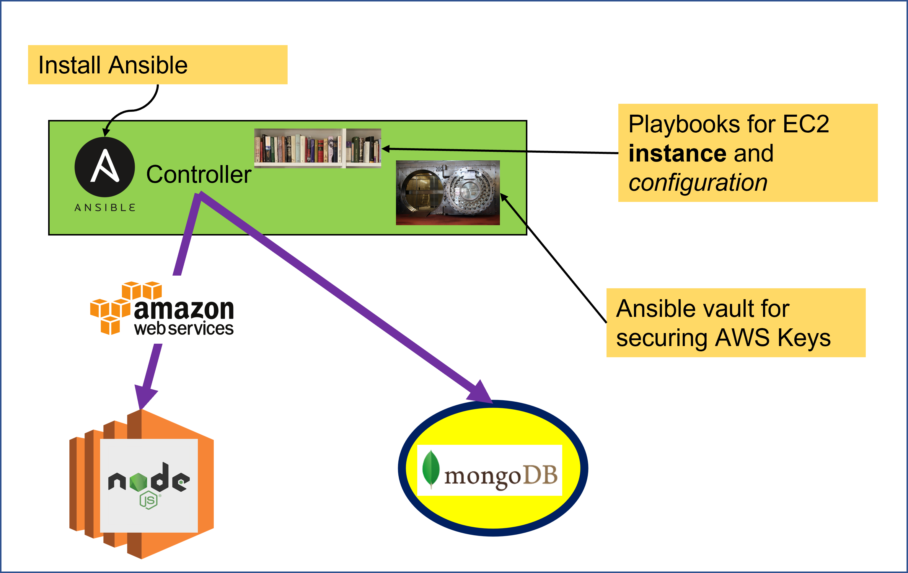

# Hybrid Architecture
There are scenarios in which a database needs to be kept on business premises for security reasons. The below playbooks will set this hybrid system up.



## run_playbooks.yml

```yaml
---
# Run Mongodb Playbook
- name: Running MongoDB Playbook
  import_playbook: set_up_db.yml

# Run Nginx Playbook
- name: Running Nginx Playbook
  import_playbook: set_up_nginx.yml

# Run Dependencies Playbook
- name: Running Install Dependencies Playbook
  import_playbook: install_dependencies.yml

# Run App Playbook
- name: Running App Playbook
  import_playbook: run_app.yml
```

Use the command `sudo ansible-playbook run_playbooks.yml --ask-vault-pass` to run the above playbook, but only once you have written the playbooks that it imports:

## set_up_db.yml

```yaml
---

# Specifies the host
- hosts: db

# Get the facts
  gather_facts: yes

# Give us admin access
  become: true

  tasks:

# Installs mongodb
  - name: Install mongodb
    apt: pkg=mongodb state=present

# Deletes the configuration file as we need to make changes to it
  - name: Delete mongodb.conf file
    file:
      path: /etc/mongodb.conf
      state: absent

# Create a new file called mongodb.conf with read and write permissions for everyone

  - name: Create new mongodb.conf file with read and write permissions for everyone
    file:
      path: /etc/mongodb.conf
      state: touch
      mode: '666'

# Fills the file with the information again but with bindIp being 0.0.0.0
  - name: Inject lines into the newly created mongodb.conf
    blockinfile:
      path: /etc/mongodb.conf
      block: |
        "storage:
          dbPath: /var/lib/mongodb
          journal:
            enabled: true
        systemLog:
          destination: file
          logAppend: true
          path: /var/log/mongodb/mongod.log
        net:
          port: 27017
          bindIp: 0.0.0.0"
```

## set_up_nginx.yml

```yaml
---
        # where do we want to install
- hosts: aws

        # get the facts
  gather_facts: yes

        # changes access to root user
  become: true

  tasks:

        # Purge Nginx
  - name: Purge Nginx
    shell: |
      sudo apt-get purge nginx nginx-common -y

        # Install Nginx
  - name: Install nginx
    apt: pkg=nginx state=present

        # Set up reverse proxy

  - name: Remove Nginx default file
    file:
      path: /etc/nginx/sites-enabled/default
      state: absent

  - name: Create file reverse_proxy.config with read and write permissions for everyone
    file:
      path: /etc/nginx/sites-enabled/reverse_proxy.conf
      state: touch
      mode: '666'

  - name: Inject lines into reverse_proxy.config
    blockinfile:
      path: /etc/nginx/sites-enabled/reverse_proxy.conf
      block: |
        server{
          listen 80;
          server_name development.local;
          location / {
              proxy_pass http://localhost:3000;
              proxy_http_version 1.1;
              proxy_set_header Upgrade $http_upgrade;
              proxy_set_header Connection 'upgrade';
              proxy_set_header Host $host;
              proxy_cache_bypass $http_upgrade;
          }
        }

        # Links the new configuration file to NGINX’s sites-enabled using a command.

  - name: link reverse_proxy.config
    file:
      src: /etc/nginx/sites-enabled/reverse_proxy.conf
      dest: /etc/nginx/sites-available/reverse_proxy.conf
      state: link

  - name: Restart Nginx
    shell: |
      sudo systemctl restart nginx
```

## install_dependencies.yml

```yaml
---
# where do we want to install
- hosts: aws

  # get the facts
  gather_facts: yes

  # changes access to root user
  become: true

  tasks:

  - name: Install software-properties-common
    apt: pkg=software-properties-common state=present

  - name: Add nodejs apt key
    apt_key:
      url: https://deb.nodesource.com/gpgkey/nodesource.gpg.key
      state: present

  - name: Install nodejs
    apt_repository:
      repo: deb https://deb.nodesource.com/node_13.x bionic main
      update_cache: yes

  - name: Install nodejs
    apt:
      update_cache: yes
      name: nodejs
      state: present

  - name: Install npm
    shell: |
      cd app/
      npm install

  - name: Install pm2
    npm:
      name: pm2
      global: yes
```

## run_app.yml

```yaml
---
  # where do we want to install
- hosts: aws

  # get the facts
  gather_facts: yes

  # changes access to root user
  become: true

  tasks:

  - name: Run app with specified environment variable
    shell: |
      cd app/
      node seeds/seed.js
      npm start
    environment:
      DB_HOST: mongodb://34.245.27.166:27017/posts
```